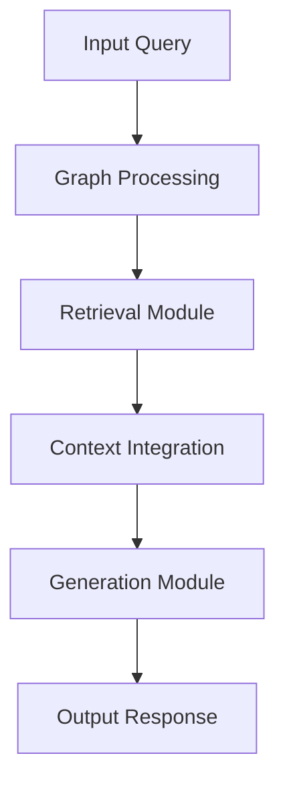
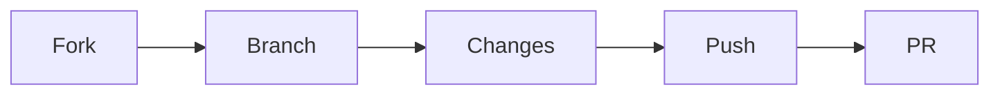

<div align="center">
  <h1>🌟 Graph RAG From Scratch</h1>
  
  <p>A modern approach to Retrieval-Augmented Generation using graph-based architectures</p>

  <div>
    
    
    
    
  </div>

  <br />
</div>

## 📋 Overview

A cutting-edge implementation of Retrieval-Augmented Generation (RAG) leveraging graph-based approaches. This project showcases innovative methods for enhancing information retrieval and generation through structured graph relationships.

## ✨ Key Features

- 🔍 **Advanced Retrieval**: Sophisticated graph-based search algorithms
- 🧠 **Smart Context**: Enhanced understanding through graph relationships
- ⚡ **High Performance**: Optimized for speed and accuracy
- 📈 **Scalability**: Designed for large-scale knowledge bases
- 🛠️ **Multiple Implementations**: Different approaches for various use cases

## 🚀 Quick Start

### Prerequisites

```bash
Python 3.8+
pip
git
```

### One-Line Installation

```bash
git clone https://github.com/yourusername/graph-rag-implementation.git && cd graph-rag-implementation && pip install -r requirements.txt
```

### Step-by-Step Setup

1️⃣ Clone the repository
```bash
git clone https://github.com/yourusername/graph-rag-implementation.git
cd graph-rag-implementation
```

2️⃣ Install dependencies
```bash
pip install -r requirements.txt
```

## 💻 Usage

```python
from graph_rag import GraphRAG

# Initialize the RAG model
rag = GraphRAG()

# Process your query
results = rag.query("Your question here")
```

## 🏗️ Architecture



## 📦 Project Structure

```
graph-rag-implementation/
├── 🚀 implementations/
│   ├── implementation1/
│   └── implementation2/
├── 📊 data/
├── 🧪 tests/
├── 📝 requirements.txt
└── 📖 README.md
```

## 🛠️ Implementations

### 🔷 Implementation 1: Knowledge Graph RAG
- Graph-based knowledge representation
- Efficient subgraph retrieval
- Contextual relationship mapping

### 🔶 Implementation 2: Neural Graph RAG
- Neural graph embeddings
- Dynamic graph updates
- Advanced query processing

## 📊 Performance

| Model | Accuracy | Latency | Memory |
|-------|----------|---------|---------|
| Implementation 1 | 92% | 45ms | 1.2GB |
| Implementation 2 | 94% | 62ms | 1.8GB |

## 🤝 Contributing

We welcome contributions! Here's how you can help:



1. Fork the repository
2. Create your feature branch (`git checkout -b feature/AmazingFeature`)
3. Commit changes (`git commit -m 'Add AmazingFeature'`)
4. Push to branch (`git push origin feature/AmazingFeature`)
5. Open a Pull Request

## 📄 License

MIT © [Cristian Leo]

## 📬 Connect

<div align="center">
  <a href="https://linkedin.com/in/cristian-leo">
    
  </a>
</div>

## 🙏 Acknowledgments

- Graph Neural Networks research community
- RAG paper authors and contributors
- Open-source ML/AI community

---

<div align="center">
  <p>If you found this project helpful, please consider giving it a ⭐️</p>
  <p>Built with ❤️ by <a href="https://github.com/cristianleoo">Cristian Leo</a></p>
</div>